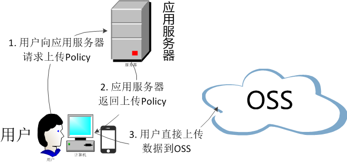

# [Web 端直传实践简介](https://help.aliyun.com/document_detail/31923.html)

## 目的

通过三个例子介绍如何在 HTML 表单提交直传 OSS：

1. 签名在客户端（javascript）完成，然后直接通过表单上传到 OSS。:-1:
1. 签名在服务端（php）完成，然后直接通过表单上传到 OSS。
1. 签名在服务端（php）完成，并且服务端设置了上传后回调。然后直接通过表单上传到 OSS，OSS回调完应用服务器再返回给用户。

## [基础篇：JavaScript 客户端签名直传](https://help.aliyun.com/document_detail/31925.html)


OSS 的 PostObject API 细节可以参照[这里](postobject.md)。

### 关键代码

只要将 plupload 发送 POST 请求时，带上 OSS 签名即可。

```javascript
var uploader = new plupload.Uploader({
    runtimes: 'html5',
    browse_button: 'selectfiles',
    container: document.getElementById('container'),
    url: host,
    multipart_params: {
        'Filename': '${filename}',
        'key': '${filename}',
        'policy': policyBase64,
        'OSSAccessKeyId': accessid,
        'success_action_status': '200',
        'signature': signature
    },
})
```

在这里有一点请注意一下，就是 `'Filename': '${filename}'`， 这一段代码的作用是表示上传后保持原来的文件文字。如果您想上传到特定目录如abc下，文件名保持成原来的文件名，那么应该这样写：

```javascript
// ...
'Filename': 'abc/' + '${filename}',
// ...
```

有时候要把用户上传的文件，设置成随机文件名，后缀保持跟客户端文件一致。如果想在上传时就固定设置成随机文件名，可以将函数改成如下：

```javascript
function check_object_radio(){
    g_object_name_type = 'random_name';
}
```

如果想固定设置成用户的文件，可以将函数改成：

```javascript
function check_object_radio() {
    g_object_name_type = 'local_name';
}
```

## [进阶篇：应用服务器 php 返回签名](https://help.aliyun.com/document_detail/31926.html)

采用 JS 客户端直接签名有一个很严重的安全隐患。就是 OSS AccessId/AccessKey 暴露在前端页面。可以随意拿到 AccessId/AccessKey，这是非常不安全的做法。 本小节将此例子进化，签名及上传 policy 从后端 php 代码取。

请求逻辑是：

1. 客户端要上传图片时，到应用服务器取上传的 policy 及签名。
1. 客户端拿到签名直接上传到 OSS。



### 获取上传后的文件名

如果要知道文件上传成功后的文件名，pupload 会调用 `FileUploaded` 事件。 如下:

```javascript
FileUploaded: function(up, file, info){
    var item = document.getElementById(file.id).getElementsByTagName('b')[0];
    if (info.status == 200) {
        item.innerHTML = 'upload to oss success, object name: ' + get_uploaded_object_name(file.name);
    } else {
        item.innerHTML = info.response;
    }
}
```

### 上传签名

javaScript 最主要是从后端取到 `policyBase64`、`accessid`、`signature` 这三个变量。 往后端取这三个变量核心代码如下：

```javascript
phpUrl = './php/get.php';
xmlhttp.open( "GET", phpUrl, false );
xmlhttp.send( null );
var obj = eval ("(" + xmlhttp.responseText+ ")");
host = obj['host']
policyBase64 = obj['policy']
accessid = obj['accessid']
signature = obj['signature']
expire = parseInt(obj['expire'])
key = obj['dir']
```

现在解析一下 `xmlhttp.responseText`（以下仅为示例，并不一定要求是以下的格式，但是必须有signature、accessid、policy这三个值）。

```json
{
    "accessid":"6MKOqxGiGU4AUk44",
    "host":"http://post-test.oss-cn-hangzhou.aliyuncs.com",
    "policy":"eyJleHBpcmF0aW9uIjoiMjAxNS0xMS0wNVQyMDoyMzoyM1oiLCJjxb25kaXRpb25zIjpbWyJjcb250ZW50LWxlbmd0aC1yYW5nZSIsMCwxMDQ4NTc2MDAwXSxbInN0YXJ0cy13aXRoIiwiJGtleSIsInVzZXItZGlyXC8iXV19",
    "signature":"I2u57FWjTKqX/AE6doIdyff151E=",
    "expire":1446726203,
    "dir":"user-dir/"
}
```

* accessid: 指的用户请求的accessid。注意仅知道accessid, 对数据不会有影响。
* host: 指的是用户要往哪个域名发往上传请求。
* policy：指的是用户表单上传的策略policy，是经过base64编码过的字符串。
* signature：是对上述第三个变量policy签名后的字符串。
* expire：指的是当前上传策略失效时间，这个变量并不会发送到OSS，因为这个已经指定在policy里面。

现在分析一下policy的内容，将其解码后的内容是：

```json
{
    "expiration":"2015-11-05T20:23:23Z",
    "conditions":[
        ["content-length-range",0,1048576000],
        ["starts-with","$key","user-dir/"]
    ]
}
```

这里有一个关键的地方，PolicyText 指定了该 Policy 上传失效的最终时间。即在这个失效时间之前，都可以利用这个 policy 上传文件，所以没有必要每次上传，都去后端取签名。为了减少后端的压力，这里的设计思路是：初始化上传时，每上传一个文件后，取一次签名。然后再上传时，将当前时间跟签名时间对比，看签名时间是否失效了。如果失效了，就重新取一次签名，如果没有失效就不取。这里就用到了变量 expire。核心代码如下：

```javascript
now = timestamp = Date.parse(new Date()) / 1000;
//可以判断当前expire是否超过了当前时间，如果超过了当前时间，就重新取一下，3s 做为缓冲[/color]
if (expire < now + 3){
    // ...
    phpUrl = './php/get.php'
    xmlhttp.open( "GET", phpUrl, false );
    xmlhttp.send( null );
    // ...
}
```

## [终极篇：应用服务器 php 返回签名及采用上传回调](https://help.aliyun.com/document_detail/31927.html)

当采用服务端签名后直传方案后，问题来了，用户上传数据后，很多场景下，应用服务器都要知道用户上传了哪些文件，文件名字，甚至如果是图片的话，图片的大小等。为此OSS开发了上传回调功能。

用户的请求逻辑

1. 用户向应用服务器取到上传 policy 和回调设置。
2. 应用服务器返回上传 policy 和回调。
3. 用户直接向 OSS 发送文件上传请求。
4. 等文件数据上传完，OSS 给用户 Response 前，OSS 会根据用户的回调设置，请求用户的服务器。
5. 如果应用服务器返回成功，那么就返回用户成功，如果应用服务器返回失败，那么 OSS 也返回给用户失败。这样确保了用户上传成功的照片，应用服务器都已经收到通知了。
6. 应用服务器给 OSS 返回。
7. OSS 将应用服务器返回的内容返回给用户。

